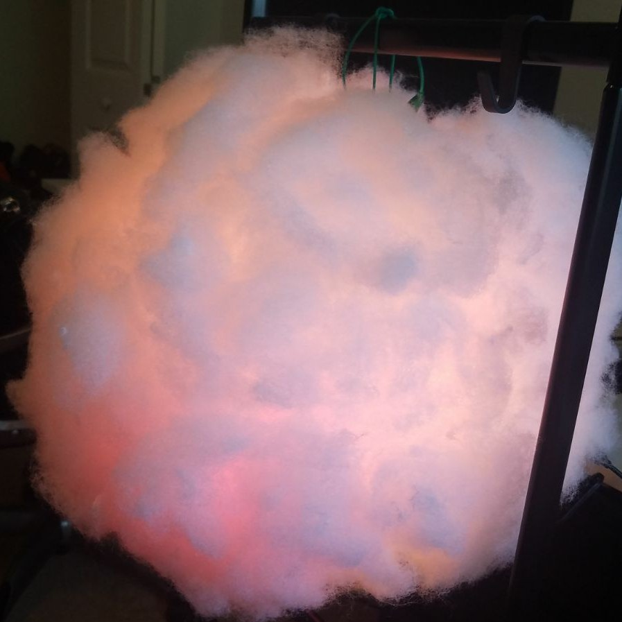

# ESP12E Based Weather Cloud Lamp

<div style="text-align:center"></div>

A cloud shaped lamp that pulls weather data and changes color based on the
present weather conditions. The ESP12E module is used to pull data from the
internet and control the LED strip. I used the Arduino environment to program
the ESP12E the following libraries are required.

* ESP8266WiFi.h
* ArduinoJson.h
* Adafruit_DotStar.h

## Weather Underground

Weather data is pulled from the Weather Underground API. A **wunderground_key.h**
file needs to be created and Weather Underground API key needs to be provided
using the keyword **WU_API_KEY**.
This is a free service that any developer can get.

## BOM

* [nodeMCU(esp12e) module](https://www.amazon.com/HiLetgo-Version-NodeMCU-Internet-Development/dp/B010O1G1ES/ref=sr_1_1?ie=UTF8&qid=1499217208&sr=8-1&keywords=esp12e)
* [White Paper Lantern Lamp](https://www.amazon.com/gp/product/B0073YPHHW/ref=oh_aui_detailpage_o00_s00?ie=UTF8&psc=1)
* [Polyester Fiber](https://www.amazon.com/gp/product/B000YZ7G44/ref=oh_aui_detailpage_o00_s00?ie=UTF8&psc=1)
* [Hot Melt Glue Gun](https://www.amazon.com/gp/product/B01178RVI2/ref=oh_aui_detailpage_o00_s01?ie=UTF8&psc=1)
* [Adafruit DotStar Digital LED Strip - Black 60 LED](https://www.adafruit.com/product/2239)
* [5V 4A (4000mA) switching power supply ](https://www.adafruit.com/product/1466)


## WiFi Credentials

Need to create a `wifi_credentials.h` file to pass WiFi credentials.

```
#ifndef WIFI_CREDENTIALS_H
#define WIFI_CREDENTIALS_H

#define WIFI_SSID "*********"
#define WIFI_PASS "*********"

#endif
```

## Android Color Picker

There is also an Android application that can be used to select different modes
and colors for the cloud see [android app](https://github.com/asuar078/weather_cloud_color_picker).
The android phone and cloud must be on the same network for the application to work.
